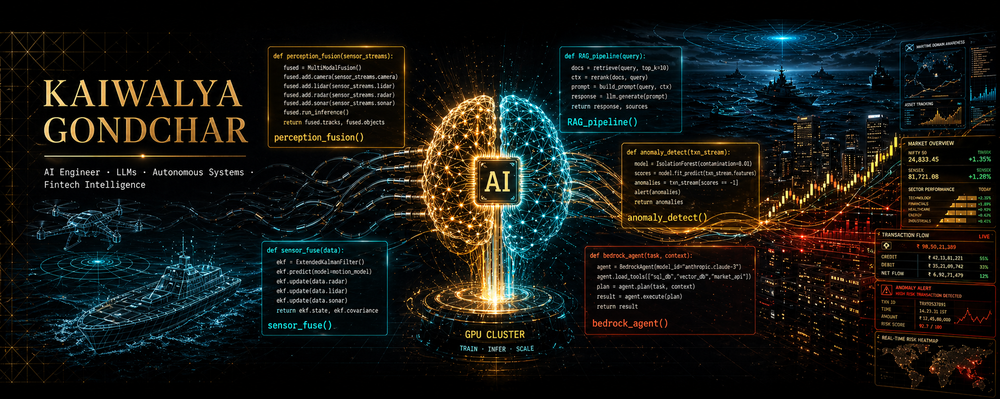
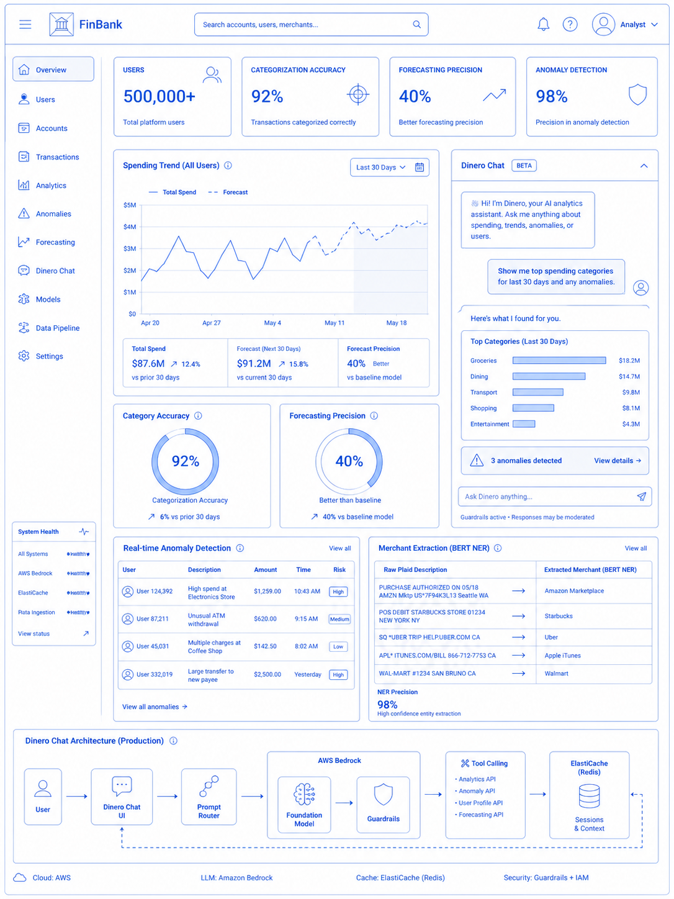
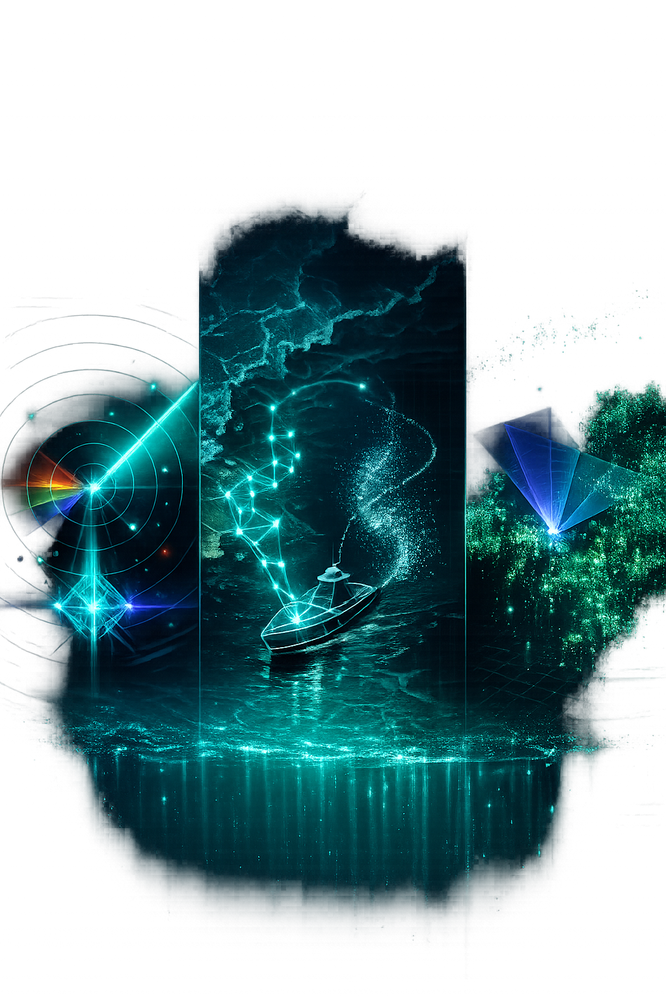

<!-- ════════════════════════════════════════════════════════════════════ -->
<!--  KAIWALYA GONDCHAR · AI ENGINEER · SYSTEMS ARCHITECT · DEFENSE TECH  -->
<!-- ════════════════════════════════════════════════════════════════════ -->

<a href="https://github.com/kaiwalya1610">
  
</a>

<div style="font-family: 'Fira Code', 'Fira Mono', ui-monospace, 'SFMono-Regular', Menlo, Consolas, monospace;">

<div align="center">

<!-- ───── ANIMATED IDENTITY ───── -->

<a href="https://github.com/kaiwalya1610">
  
</a>

<br/>

<!-- ───── IMPACT STRIP ───── -->

<table align="center">
<tr>
<td align="center" width="33%">
  <strong>500K+</strong><br/>
  <sub>fintech users served</sub>
</td>
<td align="center" width="33%">
  <strong>13×</strong><br/>
  <sub>USV path-planning speedup</sub>
</td>
<td align="center" width="33%">
  <strong>99.998%</strong><br/>
  <sub>uptime through traffic surge</sub>
</td>
</tr>
</table>

<br/>

<!-- ───── LIVE METRICS STRIP ───── -->

<a href="https://github.com/kaiwalya1610">
  
</a>
<a href="https://www.linkedin.com/in/kaiwalya-gondchar/">
  
</a>
<a href="https://github.com/kaiwalya1610?tab=followers">
  
</a>

</div>

<br/>

<!-- ════════════════════════════════════════════════════════════════════ -->
<!--                          MISSION DOSSIER                              -->
<!-- ════════════════════════════════════════════════════════════════════ -->

```ansi
╔══════════════════════════════════════════════════════════════════════╗
║  ⏵  DOSSIER · CLASSIFICATION: PUBLIC                                 ║
║  ⏵  CALLSIGN .......... kaiwalya1610                                 ║
║  ⏵  ROLE .............. Data Scientist · Product & Growth            ║
║  ⏵  THEATER ........... Vola Finance ◇ AI / Fintech                  ║
║  ⏵  PRIOR OPS ......... Indian Navy IDEX · Quidich Innovation Labs   ║
║  ⏵  SPECIALTIES ....... LLMs · CUDA · SLAM · Sensor Fusion · RAG     ║
╚══════════════════════════════════════════════════════════════════════╝
```

### `>` whoami

I build **AI systems that survive contact with production** — agentic fintech copilots for 500K+ users, autonomous USVs for Indian Navy trials, and CUDA-accelerated vision systems for live sports broadcasts.

My edge is the messy middle where **ML, systems, and product scale** collide: GPS-denied SLAM, air-gapped RAG, BERT-based transaction intelligence, Bedrock agents, and GPU kernels pushed until latency stops complaining.

<br/>

<!-- ════════════════════════════════════════════════════════════════════ -->
<!--                          TECH ARSENAL                                 -->
<!-- ════════════════════════════════════════════════════════════════════ -->

<div align="center">

## ▰▱▰▱  TECH ARSENAL  ▱▰▱▰

</div>

<table align="center">
<tr>
<td valign="top" width="50%">

#### `[ AI / ML / DEEP LEARNING ]`


</td>
<td valign="top" width="50%">

#### `[ SYSTEMS / LANGUAGES ]`


</td>
</tr>
<tr>
<td valign="top" width="50%">

#### `[ FULL-STACK / FRAMEWORKS ]`


</td>
<td valign="top" width="50%">

#### `[ CLOUD / INFRA / DATA ]`


</td>
</tr>
</table>

<br/>

<!-- ════════════════════════════════════════════════════════════════════ -->
<!--                      FEATURED OPERATIONS                              -->
<!-- ════════════════════════════════════════════════════════════════════ -->

<div align="center">

## ▰▱▰▱  FEATURED OPERATIONS  ▱▰▱▰

*Selected missions from a longer service record.*

</div>

<br/>

### 💸  `OP-01` · Vola Bank Analytics + Dinero Chat
> **Client:** Vola Finance · **Role:** Data Scientist, Product & Growth · **Stack:** AWS Bedrock · EC2 · ElastiCache · BERT

<table>
<tr>
<td width="40%" valign="top" align="center">



</td>
<td width="60%" valign="top">

**Problem:** Raw banking data is noisy, user intent is messy, and financial insights have to feel instant at consumer scale.

**System:** Built a bank-analytics surface for **500,000+ users** with **Dinero Chat**, a production agentic AI on **AWS Bedrock** using prompt routing, guardrails, tool-calling, and ElastiCache-backed sessions.

**Impact:** Hit `92%` categorization accuracy, improved forecasting precision by `40%`, caught irregular spending at `98%` precision, and used **BERT NER** to extract merchant names from raw Plaid transaction blobs.

<sub>`500K+` users   •   `99.998%` uptime through `300%+` traffic surge   •   `+25%` weekly engagement</sub>

</td>
</tr>
</table>

---

<table>
<tr>
<td width="60%" valign="top">

### 🛰️  `OP-02` · Autonomous USV — Perception, SLAM & Path Planning
> **Client:** Indian Navy (IDEX) · **Role:** Lead Developer · **Stack:** C++ · ROS · CUDA · SLAM · Sensor Fusion

A real-time marine perception stack fusing **RGB, IR, and radar** with custom drivers, married to a **SLAM + IMU + GPS + RADAR** odometry pipeline that holds dead-reckoning in GPS-denied waters. A proprietary **A\* variant** delivered a **13× (1,200%)** speedup in live navigation while cutting compute overhead by **90%**.

<sub>`95%` situational-awareness accuracy   •   `40%` better obstacle detection in low-visibility   •   `13×` path-planning speedup</sub>

</td>
<td width="40%" valign="top" align="center">



</td>
</tr>
</table>

---

### 🧠  `OP-03` · QBMS — On-Premise RAG over Classified Corpora
> **Client:** Indian Navy · **Role:** Lead Developer · **Stack:** Python · Fine-tuned LLMs · KV-Cache Optimization

Architected a **secure, air-gapped RAG system** with fine-tuned LLMs that auto-generates question banks from complex PDFs — **100% data sovereignty**, zero cloud egress. An optimized **Key-Value Cache** strategy slashed document-processing latency by **45%**, and human-in-the-loop semantic search lifted answer relevance by **30%**.

<sub>`60%` faster content production   •   `45%` lower latency   •   `100%` on-prem & compliant</sub>

---

### 🏏  `OP-04` · Quidich Tracker — AI Motion Capture (Sports Innovation Award 2022)
> **Client:** Quidich Innovation Labs · **Role:** Lead Developer · **Stack:** CUDA · Computer Vision · 2D/3D Pose

A **CUDA-accelerated** vision pipeline driving live cricket broadcasts: object detection + tracking + **2D/3D pose estimation** for digital-twin rendering, plus the **Quidich Tracker** for live player detection. Region-based tagging and parameter tuning produced a **96% reduction in tracking errors** — and the **Sports Innovation Award at the 2022 Sports Business Awards**.

<sub>`96%` fewer tracking errors   •   global sports-tech recognition   •   real-time broadcast rendering</sub>

---

### 🔬  `OP-05` · Auto-Alpha-Forge — Agentic Quant Research Platform
> **Repo:** [`kaiwalya1610/Auto-Alpha-Forge`](https://github.com/kaiwalya1610/Auto-Alpha-Forge.git) · **Stack:** Python · Agentic Loops · Event-driven Backtesting

An **autonomous research agent** that proposes, implements, backtests, and iterates on trading strategies in a self-contained loop — harness-agnostic. Backed by a production **event-driven backtester** with bar-by-bar simulation, 8 position-sizing methods, VaR/Sharpe/drawdown analytics, composite scoring, and git-based experiment tracking with overfitting safeguards.

---

### ⚡  `OP-06` · DSA in CUDA — Algorithms on the GPU
> **Repo:** [`kaiwalya1610/DSA-in-CUDA`](https://github.com/kaiwalya1610/DSA-in-CUDA.git) · **Stack:** CUDA C/C++

Hot-take: not every LeetCode problem belongs on a CPU. Re-engineered classic sorting, searching, and graph algorithms as **parallelized GPU kernels** with optimized thread management and memory access — clocking up to **1,500% speedup** on high-complexity workloads.

---

### 📈  `OP-07` · TradeEdge — AI Trading Lab (Mobile)
> **App:** [Google Play](https://play.google.com/store/apps/details?id=com.tradeedge.app) · **Stack:** React Native · Python/Flask · Digital Ocean

A full-stack real-time stock-market simulator with an **LLM-powered review agent** that critiques every trade. Resilient backend on Digital Ocean serving live market data under high-concurrency load — shipped end-to-end and live on the Play Store.

<br/>

<!-- ════════════════════════════════════════════════════════════════════ -->
<!--                            COMMS                                      -->
<!-- ════════════════════════════════════════════════════════════════════ -->

<div align="center">

## ▰▱▰▱  ESTABLISH COMMS  ▱▰▱▰

*Open to high-signal collaborations across AI research, defense systems, and applied ML.*

<br/>

<a href="https://www.linkedin.com/in/kaiwalya-gondchar/">
  
</a>
<a href="mailto:kaiwalyagondchar1610@gmail.com">
  
</a>
<a href="https://github.com/kaiwalya1610">
  
</a>
<a href="https://play.google.com/store/apps/details?id=com.tradeedge.app">
  
</a>

<br/><br/>

</div>

</div>

<!-- ════════════════════════════════════════════════════════════════════ -->
<!--                           FOOTER                                      -->
<!-- ════════════════════════════════════════════════════════════════════ -->


